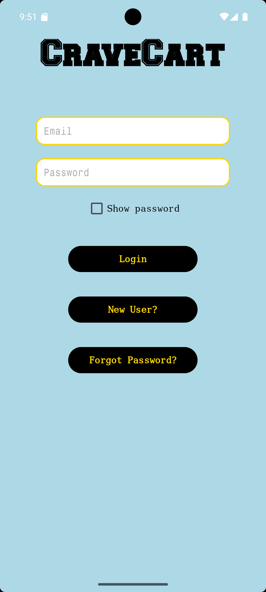
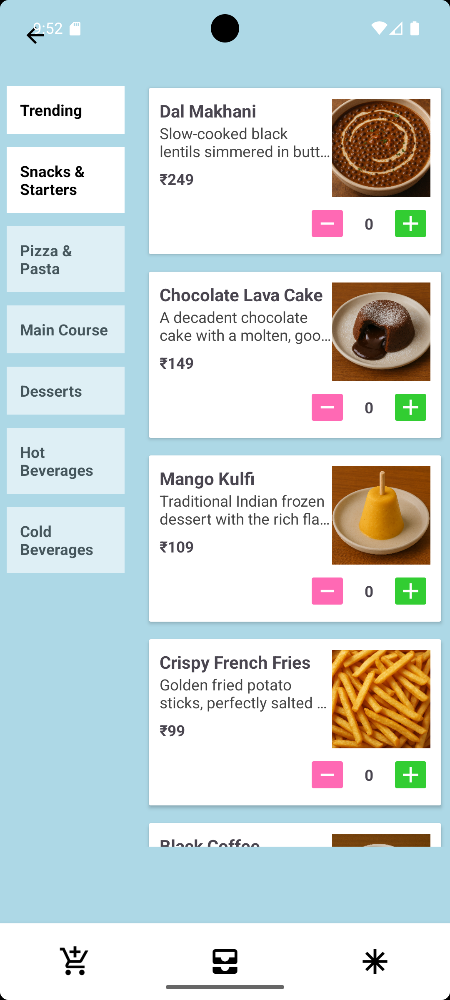
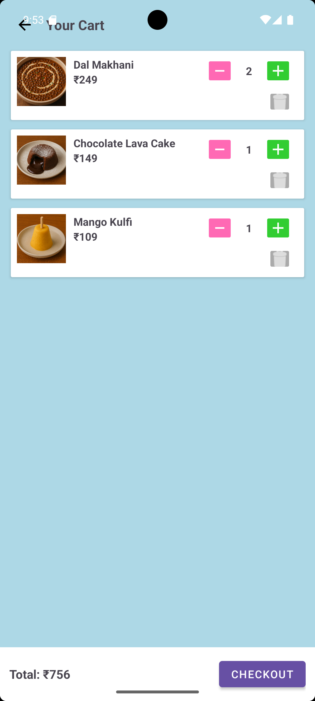
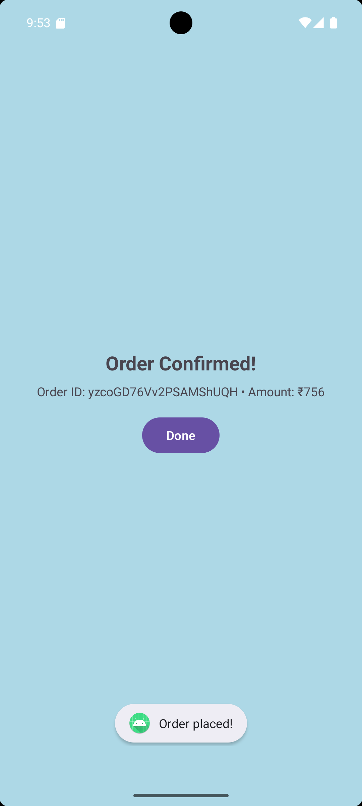

# CraveCart 🍔

CraveCart is a Firebase-powered Android food-ordering app built with Java and XML.

The app lets users browse a category-based food menu, manage a persistent local cart, place Cash on Delivery demo orders, and review order history.

> **Project status:** Restored working baseline. The current Login button uses Firebase anonymous sign-in for guest access. Proper email/password login, password reset, secure payment verification, and AI food discovery are planned improvements.

## Screenshots

<p align="center">
  
  
  
  
</p>

## Features

- Browse category-based food items stored in Cloud Firestore
- Load menu images using Glide
- Add, increase, decrease, and remove cart items
- Persist cart data locally using Room Database
- Place Cash on Delivery demo orders
- Save and retrieve order history using Firestore
- Create accounts and send email-verification links
- Comic-inspired Android UI

## Tech Stack

| Area | Technology |
|---|---|
| Language | Java |
| UI | XML layouts, View Binding, Material Components, ConstraintLayout |
| Authentication | Firebase Authentication |
| Cloud Database | Cloud Firestore |
| Local Database | Room |
| Lists | RecyclerView |
| Images | Glide |
| Payments | Razorpay Checkout SDK |
| Build System | Gradle Wrapper |

## App Flow

```text
Login / Guest Access
        ↓
Dashboard
        ↓
Menu
        ↓
Cart
        ↓
Checkout
        ↓
Order Success
        ↓
Order History


Requirements
Android Studio
Android SDK API 36
Java 11
Firebase project
Android device or emulator running Android 7.0 (API 24) or above
Local Setup
1. Clone the repository
git clone https://github.com/Jastador/CraveCart.git
cd CraveCart
2. Configure Firebase

This repository intentionally does not include google-services.json.

Create a Firebase project.
Add an Android app with this package name:
com.example.cravecart
Download google-services.json.
Place it here:
app/google-services.json
In Firebase Authentication, enable:
Anonymous
Email/Password
Create a Cloud Firestore database and configure rules appropriate for your environment.

Do not leave Firestore in open test mode for a real/public app.

3. Seed demo menu data

The project contains SeedMenu.java with demo food items.

Open DashboardActivity.java.
Temporarily change:
boolean DEBUG_SEED = false;

to:

boolean DEBUG_SEED = true;
Run the app once.
Confirm menu items appear.
Immediately change it back to:
boolean DEBUG_SEED = false;

SeedMenu currently uses Firestore auto-generated IDs, so running it repeatedly creates duplicate menu items.

4. Run the app
Open the project in Android Studio.
Let Gradle sync complete.
Select an emulator or Android device.
Press Run ▶.
Current Limitations
Login currently uses anonymous Firebase authentication and does not yet validate entered email/password fields.
Forgot Password is not implemented yet.
Razorpay is included as an integration scaffold and needs server-side payment verification before real payments can be accepted.
Menu seeding can create duplicate items when run repeatedly.
Planned Improvements
 Proper email/password login and password reset
 Guest-mode separation
 Cart quantity synchronization
 Search, filters, favourites, and food-detail pages
 Saved addresses and richer order tracking
 Firebase Security Rules hardening
 Smart AI Food Finder
 AI meal recommendations based on budget, diet, spice level, and protein preference


